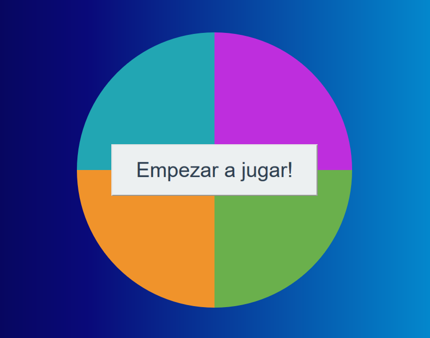

<H1 align="center"> Latam Scraper </H1>

   

 
   <b>Simon dice</b>
                
----
### Description
Basic Game make in JavaScript. You must follow the sequence of the colors and replicate it again

### Requirement
<code> git clone https://github.com/julianramirezch/simon_dice.git </code>
 

### Use

 Open simon.html in your browser 

### Tasks:

| Name | Description                    |
| ------------- | ------------------------------ |
| `simon.html`      |  Simon Game |

## Author: 
### Julian Ramirez <julianramirezch1@gmail.com>
----

2020